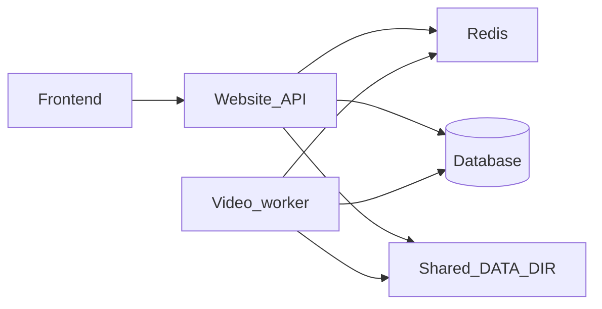

# Architecture

## Three processes

PostClipper is designed to run as **three separate processes** in production:

| Process | Role |
|---------|------|
| **Frontend** | Vite SPA ([`frontend/`](../frontend/)); talks to the website API (e.g. `/api` proxy in dev). |
| **Website backend** | FastAPI app ([`backend/app/main.py`](../backend/app/main.py)): CRUD, dashboard JSON, enqueue jobs to Redis, optional media `FileResponse` when `DATA_DIR` is readable. Can run **slim** deps ([`requirements-api.txt`](../backend/requirements-api.txt)) and `API_SKIP_MEDIA_CHECK=true` so FFmpeg is not required in the container. |
| **Video processing backend** | Arq worker ([`backend/app/worker.py`](../backend/app/worker.py)): yt-dlp ingest, FFmpeg normalize/proxy/render, transcribe, suggest, publish. Full deps ([`requirements-worker.txt`](../backend/requirements-worker.txt)); **FFmpeg on PATH** in the worker image. |

Shared infrastructure:

- **Redis** — Arq job queue (set `REDIS_URL` on API and worker).
- **Postgres** (recommended for multi-container) or SQLite (single machine dev).
- **`DATA_DIR`** — Same filesystem (shared volume / NFS) on API and worker so uploads land where the worker reads them and generated drafts are visible to the API for streaming.

## Live status

Job **status** and **logs** are written by the worker to the database. The website API serves them via `GET /api/jobs` and `GET /api/jobs/{id}` (cheap DB reads, not blocked by FFmpeg). The UI polls while jobs are non-terminal so progress stays visible without SSE.

## Deferred

- Hybrid TS/Go API + Python worker (API contract only; queue unchanged).
- Presigned object storage for uploads (today: multipart to API into shared `DATA_DIR`).
- Optional SSE/WebSocket for log streaming.

See [`deploy.md`](deploy.md) and the executable checklist [`docker-three-process-runbook.md`](docker-three-process-runbook.md) for Docker Compose and env vars.
